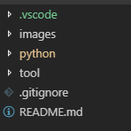

# The README Instruction

** Part 1: Vision AI Environment Setup **

** Part 2: Instruction for Training Vision Models using Azure Machine Learning Vision Cognitive **

Thursday, March 14, 2019
2:16 PM

Note: This is a demo project to show you how to create custom vision model files

Prerequisites: Account at
https://www.customvision.ai/projects

**Part 1: Vision AI Environment Setup**

This notes provide instructions "How to setup Azure Vision AI Environment"

**Windows 10:**

	1. Install Python 3.7+
	Download Python 3.7+ software at https://www.python.org
	How to document at https://docs.python.org/3/
	
	2. Install Git
	Download Git software at https://git-scm.com/downloads
	How to install in windows exe at
	https://git-scm.com/download/win
	Optional instruction:
	https://www.onlinetutorialspoint.com/git/how-to-install-git-windows-10-operating-system.html
	https://cs.hofstra.edu/docs/pages/guides/git_win_install.html

	3. Python Visual Studio Code
	https://code.visualstudio.com/docs/languages/python
	Tutorial at
	https://code.visualstudio.com/docs/python/python-tutorial

	4. Open "Windows PowerShell" or "Command Prompt" with "run as administrator"
	Reference guide can be found at https://docs.microsoft.com/en-us/azure/cognitive-services/custom-vision-service/python-tutorial
	
	install vision AI libraries, type command
	>pip install --upgrade azure-cognitiveservices-vision-customvision

**Linux/iOS:**

	1. Login Ubuntu or Ubuntu VM version 18.04;

	2.Default Python maybe 3.5 or 3.6. Install Python 3.7.2:
	    2.1 install build tools:
		$sudo apt-get install build-essential checkinstall
		$sudo apt-get install libreadline-gplv2-dev libncursesw5-dev libssl-dev \
		    	libsqlite3-dev tk-dev libgdbm-dev libc6-dev libbz2-dev
		$sudo apt-get install libffi-dev
	
	    2.2 Download python 3.7.2:
		$cd /usr/src
		$sudo wget https://www.python.org/ftp/python/3.7.2/Python-3.7.2.tgz

	    2.3 Extract tgz:
		$sudo tar xzf Python-3.7.2.tgz
	
	    2.4 Compile:
		$cd Python-3.7.2
		$sudo ./configure --enable-optimizations
		$sudo make altinstall
	
	    2.5 Add alias into ~/.bashrc
		alias python='/usr/local/bin/python3.7m'
	 3. Install pip:
		$curl https://bootstrap.pypa.io/get-pip.py -o get-pip.py
		$sudo python get-pip.py
		$sudo pip install --upgrade pip
	
	 4. Following steps same as Windows users (use sudo for admin users)
		Optional use PyCharm or Intellij Community SDK

Part 2 - Training Models

	1. Azure Vision Machine Learning API documents and Custom Vision API Document locates at
	https://docs.microsoft.com/en-us/azure/cognitive-services/custom-vision-service/

	How to Create Account and Get Started Guide at
		https://docs.microsoft.com/en-us/azure/cognitive-services/custom-vision-service/getting-started-build-a-classifier
	
	2.Prepare Image files
	Image samples are located at "images" folder

	3.Start Visual Studio Code and Open folder
	   vision-ai-developer-kit\sample-solutions\VisionSample\CustomVisionImageTraining
	   Sample python scripts are located at "python" folder

	4. Sign in Account and click setting button:
	   https://www.customvision.ai/projects
	   Or Testing site: https://iris-demo1.azurewebsites.net/

	   Modify python folder	__init__.py contains vision AI training keys
		TRAINING_KEY = "place training key here"
		TRAINING_ENDPOINT = "https://irisdemo1.azure-api.net/"

	5.Save changes and right click - custom_vision_training_sample.py
	   Run Python File in Terminal

	6. Go to project:
	https://www.customvision.ai/projects
	download trained model files
	(Note: DLC file only can be downloaded at test site: https://iris-demo1.azurewebsites.net/ )

	7. Deploy this model on IoTEdgeSolution Project. Please read the project README.md
